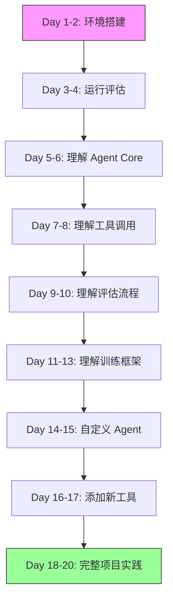

# ASearcher 项目深度学习指南

本文档提供了一个系统化的 ASearcher 项目学习路径，通过模块化分析方法帮助开发者深入理解项目架构、核心组件实现细节、数据流机制和自定义开发方法。

## 📚 目录

1. [项目概览](#1-项目概览)
2. [快速入门路径](#2-快速入门路径)
3. [项目模块架构](#3-项目模块架构)
4. [核心模块详解](#4-核心模块详解)
   - [Module 1: Agent Core](#module-1-agent-core-智能体核心)
   - [Module 2: Training Framework](#module-2-training-framework-训练框架)
   - [Module 3: Evaluation System](#module-3-evaluation-system-评估系统)
5. [数据流与交互机制](#5-数据流与交互机制)
6. [自定义开发指南](#6-自定义开发指南)
7. [学习资源与实践](#7-学习资源与实践)

---

## 1. 项目概览

ASearcher 是一个开源的大规模在线强化学习（RL）训练框架，专为搜索智能体设计。

### 核心创新点

- 🔁 **数据合成 Agent**: 自动生成高质量、有挑战性的 QA 对
- ⚡ **完全异步的 Agentic RL**: 解耦轨迹收集与模型训练，消除 GPU 空闲时间
- 🌐 **长轨迹搜索能力**: 支持超过 40 轮工具调用和 150k tokens 生成
- 🏆 **SOTA 性能**: 在 GAIA、xBench-DeepSearch 等基准上达到领先水平
- 📈 **显著的 RL 提升**: 通过 RL 训练带来 +9.1 到 +13.4 的性能提升

### 核心设计理念

1. **异步架构优势**：传统同步 RL 需要等待最长轨迹完成，GPU 利用率仅 40-60%；完全异步架构将 GPU 利用率提升至 85-95%
2. **模块化设计**：Agent、Training、Evaluation 三大模块松耦合，便于独立开发和测试
3. **工具调用统一接口**：通过 XML 标签（`<search>`, `<access>`, `<answer>`）统一工具调用接口

---

## 2. 快速入门路径

### 第一阶段：环境搭建与初次运行（1-2天）

```bash
# 1. 克隆项目
git clone https://github.com/inclusionAI/ASearcher.git
cd ASearcher

# 2. 安装依赖
cd AReaL
pip install -e .
pre-commit install  # 安装代码格式化工具

# 3. 配置必要的 API Keys
export SERPER_API_KEY="your_serper_key"  # 用于网页搜索
export JINA_API_KEY="your_jina_key"      # 用于内容提取

# 4. 下载测试数据
# 从 https://huggingface.co/datasets/inclusionAI/ASearcher-test-data 下载

# 5. 运行第一个评估
cd ../evaluation
python3 search_eval_async.py \
    --data_names GAIA \
    --model_name_or_path <model_path> \
    --agent-type asearcher \
    --search-client-type async-web-search-access \
    --tensor_parallel_size 1 \
    --pass-at-k 1
```

### 第二阶段：理解核心概念（2-3天）

必读文档：
- `README.md` - 项目概述和主要功能
- `docs/evaluation.md` - 评估流程详解
- `docs/training.md` - 训练方法说明
- `CLAUDE.md` - 快速参考手册

关键概念理解：
1. **异步 RL 训练**：如何解决变长轨迹的 GPU 空闲问题
2. **多轮工具调用**：Agent 如何进行长达 128 轮的搜索对话
3. **数据合成**：如何自动生成高质量的训练数据

### 第三阶段：深入代码实现（3-5天）

推荐学习顺序：
1. **Agent Core** → 理解智能体行为和状态管理
2. **Evaluation System** → 理解端到端的执行流程
3. **Training Framework** → 理解 RL 训练机制

---

## 3. 项目模块架构

### 整体架构图

```
ASearcher 项目结构
═══════════════════════════════════════════════════════════

┌────────────────────────────────────────────────────────┐
│                    ASearcher Project                    │
├────────────────────────────────────────────────────────┤
│                                                        │
│  ┌──────────────────────────────────────────────────┐ │
│  │           Module 1: Agent Core                    │ │
│  │    智能体实现与搜索工具                            │ │
│  └──────────────────────────────────────────────────┘ │
│                                                        │
│  ┌──────────────────────────────────────────────────┐ │
│  │         Module 2: Training Framework              │ │
│  │    AReaL 异步 RL 训练框架                         │ │
│  └──────────────────────────────────────────────────┘ │
│                                                        │
│  ┌──────────────────────────────────────────────────┐ │
│  │          Module 3: Evaluation System              │ │
│  │    评估、测试与性能分析                            │ │
│  └──────────────────────────────────────────────────┘ │
│                                                        │
│  ┌──────────────────────────────────────────────────┐ │
│  │        Module 4: Data & QA Synthesis              │ │
│  │    数据合成与处理                                  │ │
│  └──────────────────────────────────────────────────┘ │
└────────────────────────────────────────────────────────┘
```

### 模块文件映射表

| 模块 | 核心文件 | 功能说明 |
|-----|---------|---------|
| **Module 1: Agent Core** | | 智能体核心逻辑和工具调用 |
| | `agent/asearcher.py` | 基础 Agent 类，包含 Memory 和状态管理 |
| | `agent/asearcher_reasoning.py` | 推理增强版 Agent |
| | `agent/search_r1.py` | Search-R1 Agent 实现 |
| | `tools/search_utils.py` | 搜索客户端封装（Serper、Jina） |
| | `tools/web_browser.py` | 网页浏览器实现 |
| | `tools/local_retrieval_server.py` | 本地 Wikipedia 检索服务 |
| | `AReaL/ASearcher/train/search_agent.py` | 训练专用 Agent |
| | `AReaL/ASearcher/train/prompts.py` | 提示词模板 |
| | `AReaL/ASearcher/utils/search_tool.py` | SearchToolBox 工具箱实现 |
| | `AReaL/ASearcher/utils/rewards.py` | 奖励函数（F1、EM） |
| **Module 2: Training Framework** | | 异步 RL 训练基础设施 |
| | `AReaL/ASearcher/train/asearcher.py` | ASearcherWorkflow 主训练流程 |
| | `AReaL/ASearcher/configs/*.yaml` | 训练配置文件 |
| | `AReaL/areal/workflow/multi_turn.py` | 多轮对话工作流 |
| | `AReaL/areal/engine/sglang_remote.py` | 远程推理引擎（负载均衡） |
| | `AReaL/areal/engine/fsdp_engine.py` | FSDP 训练引擎 |
| | `AReaL/areal/engine/ppo/actor.py` | PPO Actor 实现 |
| | `AReaL/areal/launcher/local.py` | 本地启动器 |
| | `AReaL/areal/launcher/ray.py` | Ray 分布式启动器 |
| | `AReaL/areal/launcher/slurm.py` | Slurm 集群启动器 |
| **Module 3: Evaluation System** | | 模型评估和性能测试 |
| | `evaluation/search_eval_async.py` | 异步评估主程序 |
| | `evaluation/evaluate.py` | 同步评估程序 |
| | `evaluation/llm_as_judge.py` | LLM 评判器 |
| | `evaluation/llm_utils.py` | LLM 工具函数 |
| | `evaluation/utils.py` | 评估指标计算 |
| | `evaluation/config_loader.py` | 配置加载器 |
| **Module 4: Data Synthesis** | | QA 对生成和数据处理 |
| | `qa_synthesis/qa_synthesis_agent.py` | QA 合成 Agent |
| | `utils/index_builder.py` | 索引构建工具 |

---

## 4. 核心模块详解

### Module 1: Agent Core (智能体核心)

#### 1.1 核心数据结构

```python
# agent/asearcher.py:6-21
@dataclass
class Record:
    """对话历史记录的基本单元"""
    type: str              # 记录类型：prompt/llm_gen/search_results/webpage
    text: str              # 完整文本内容
    short_text: str = ""   # 摘要文本（用于 prompt 构建）
    # RL 训练相关数据
    input_len: Optional[int] = None
    input_tokens: Optional[List[int]] = None
    output_len: Optional[int] = None
    output_tokens: Optional[List[int]] = None
    output_logprobs: Optional[List[float]] = None
    output_versions: Optional[List[int]] = None
```

**关键洞察**：Record 数据结构是跨模块数据传递的核心，既记录对话历史，又携带 RL 训练所需的 token 和概率信息。

#### 1.2 AgentMemory 记忆管理系统

```python
# agent/asearcher.py:23-68
class AgentMemory:
    """管理对话历史和工具交互记录"""
    
    def __init__(self, prompt):
        self.memory = [Record(type="prompt", text=prompt)]
    
    def prepare_prompt(self) -> str:
        """构建包含完整历史的 prompt"""
        prompt = ""
        for r in self.memory:
            if r.type == "prompt":
                prompt = r.text
            elif r.type in ["search_results", "webpage"]:
                # 工具结果后添加思考标记
                prompt = prompt + "\n\n" + r.short_text + "\n<think>\n"
            elif r.type == "llm_gen":
                prompt = prompt + r.text
        return prompt
    
    def logging_stats(self) -> Dict:
        """统计交互信息"""
        return {
            "num_llm_gens": 生成次数,
            "num_input_tokens": 输入 token 总数,
            "num_output_tokens": 输出 token 总数,
            "num_search_queries": 搜索次数,
            "num_success_search_queries": 成功搜索数,
            "num_pages": 访问网页数
        }
```

#### 1.3 AsearcherAgent 主类

```python
# agent/asearcher.py:69-180
class AsearcherAgent:
    """搜索智能体主类"""
    
    def __init__(self, prompt=None):
        self.memory = AgentMemory(prompt) if prompt else None
        self.job_queue = queue.Queue(128)  # 异步任务队列
        self.max_turns = 64                # 最大对话轮数
    
    @property
    def is_finished(self) -> bool:
        """检查是否已生成最终答案"""
        pattern = r'<answer>(.*?)</answer>'
        return any([re.findall(pattern, r.text) for r in self.memory.filter_records("llm_gen")])
    
    def prepare_llm_query(self) -> Tuple[str, Dict]:
        """准备 LLM 查询"""
        prompt = self.memory.prepare_prompt()
        sampling_params = dict(stop=["</search>", "</access>", "</answer>"])
        
        # 处理 job_queue 中的待处理工具响应
        if not self.job_queue.empty():
            job = self.job_queue.get_nowait()
            prompt = prompt + "\n\n" + job["text"] + "\n<think>\n"
            self.memory.add_record(Record(type=job["type"], text=job["text"]))
            sampling_params["stop"] = ["</think>"]
            
        return prompt, sampling_params
    
    def consume_llm_response(self, resp, completion_text) -> List[str]:
        """解析 LLM 响应，提取工具调用"""
        tool_calls = []
        patterns = [
            r'<search>(.*?)</search>',   # 搜索工具
            r'<access>(.*?)</access>',   # 访问网页
            r'<answer>(.*?)</answer>'    # 最终答案
        ]
        for pattern in patterns:
            matches = re.findall(pattern, completion_text, re.DOTALL)
            if matches:
                tool_calls.append(matches[-1])
        return tool_calls
```

**关键设计**：
1. **job_queue 机制**：异步处理工具响应，避免阻塞主流程
2. **XML 标签触发**：统一的工具调用接口
3. **状态管理**：通过 memory 和 is_finished 管理对话状态

#### 1.4 SearchToolBox 工具箱系统

```python
# AReaL/ASearcher/utils/search_tool.py:25-150
class SearchToolBox:
    """工具调用和奖励计算的核心组件"""
    
    def __init__(self, dataset_path: str, reward_type: str = "F1", 
                 topk: int = 10, search_client_type: str = "async-online-search-access"):
        self.id2info = load_metadata(dataset_path)  # 加载数据集元信息
        self.reward_type = reward_type              # F1 或 EM
        self.topk = topk                           # 搜索结果数量
        self.search_client = make_search_client(search_client_type)
    
    async def step(self, qid_actions: Tuple[str, List[str]]) -> List[Dict]:
        """执行工具调用并计算奖励"""
        qid, actions = qid_actions
        results = []
        
        for action in actions:
            result = dict(documents=None, score=None, ground_truth=None, type=None)
            
            # 处理搜索工具调用
            if "<search>" in action and "</search>" in action:
                query = extract_between_tags(action, "search")
                response = await self.search_client.query_async({
                    "queries": [query],
                    "topk": self.topk
                })
                result["documents"] = response[0]["documents"]
                result["urls"] = response[0]["urls"]
                result["type"] = "search"
            
            # 处理网页访问
            elif "<access>" in action and "</access>" in action:
                url = extract_between_tags(action, "access")
                response = await self.search_client.access_async([url])
                result["page"] = process_webpage(response[0].get("page", ""))
                result["type"] = "access"
            
            # 计算奖励
            ground_truth = self.id2info[qid]["answer"]
            if self.reward_type == "F1":
                extracted, score = compute_score_f1(action, ground_truth)
            elif self.reward_type == "EM":
                extracted, score = compute_score_em(action, ground_truth)
            
            result["score"] = score
            result["ground_truth"] = ground_truth
            results.append(result)
            
        return results
```

### Module 2: Training Framework (训练框架)

#### 2.1 ASearcherWorkflow 训练工作流

```python
# AReaL/ASearcher/train/asearcher.py:50-220
class ASearcherWorkflow(RolloutWorkflow):
    """异步 RL 训练的核心工作流"""
    
    def __init__(self, gconfig: GenerationHyperparameters, tokenizer: PreTrainedTokenizerFast,
                 dataset_path: str, dump_dir: str = None, max_turns: int = 128,
                 n_trajs: int = 1, search_client_type: str = "async-online-search-access",
                 reward_type: str = "F1", topk: int = 5, valid_inst_ratio: float = 1.0,
                 max_tokens: int = 32000, search_only: bool = True):
        """
        核心参数:
        - max_turns: 128        # 最大对话轮数（支持极长搜索）
        - n_trajs: 1           # 每个问题收集的轨迹数
        - reward_type: "F1"    # 奖励类型（F1 或 EM）
        - search_client_type   # 搜索客户端类型
        - valid_inst_ratio     # 有效实例比例（用于课程学习）
        """
        self.toolbox = SearchToolBox(dataset_path, reward_type, topk, search_client_type)
    
    async def collect_agent_trajectory(self, valid_inst, qid, prompt, engine):
        """收集单条轨迹（核心异步流程）"""
        agent = SearchAgent(prompt)
        score = 0
        ground_truth = None
        traj_rid = uuid.uuid4().hex  # 轨迹唯一 ID，确保路由到同一服务器
        
        while agent.num_turns < self.max_turns and not agent.is_finished:
            # 1. 准备 LLM 查询
            query_prompt, sampling_params = agent.prepare_llm_query()
            
            # 2. 异步 LLM 生成
            input_ids = self.tokenizer.encode(query_prompt)
            req = LLMRequest(rid=traj_rid, input_ids=input_ids, gconfig=self.gconfig)
            resp = await engine.agenerate(req)  # 异步生成
            completion_str = self.tokenizer.decode(resp.output_tokens)
            
            # 3. 提取工具调用
            tool_calls = agent.consume_llm_response(resp, completion_str)
            
            # 4. 异步执行工具并计算奖励
            if tool_calls:
                res = (await self.toolbox.step((qid, tool_calls)))[0]
                agent.consume_tool_response(res, topk=self.topk)
                
                if "score" in res:
                    score = res["score"]
                if "ground_truth" in res:
                    ground_truth = res["ground_truth"]
            
            # 5. 检查终止条件
            if resp.output_tokens[-1] in [tokenizer.eos_token_id]:
                break
        
        # 6. 计算最终奖励
        format_reward = float(all([correct_format_fn(i, r.text) 
                                   for i, r in enumerate(agent.memory.filter_records("llm_gen"))]))
        score = score * format_reward
        
        # 7. 处理无效问题判断
        if valid_inst and judge_q_invalid:
            score = -0.5  # 惩罚判断错误
        
        return ground_truth, score, agent.memory, stats
    
    async def arun_episode(self, engine, data):
        """运行一个训练回合"""
        # 1. 准备 prompt
        prompt_template = SEARCH_ONLY_PROMPT_TEMPLATE if self.search_only else SEARCH_ACCESS_PROMPT_TEMPLATE
        prompt = prompt_template.format(question=data["question"])
        
        # 2. 并发收集多条轨迹
        trajs = await asyncio.gather(*[
            self.collect_agent_trajectory(valid_inst, qid, prompt, engine) 
            for _ in range(self.n_trajs)
        ])
        
        # 3. 归一化奖励（减去均值）
        scores = [score for _, score, _, _ in trajs]
        score_mean = np.mean(scores)
        normalized_scores = [s - score_mean for s in scores]
        
        # 4. 转换为训练数据
        results = []
        for i, (_, score, memory, stats) in enumerate(trajs):
            for record in memory.memory:
                if record.type == "llm_gen":
                    results.append({
                        "input_ids": torch.tensor(record.input_tokens + record.output_tokens),
                        "logprobs": torch.tensor([0.0] * len(record.input_tokens) + record.output_logprobs),
                        "loss_mask": torch.tensor([0] * len(record.input_tokens) + [1] * len(record.output_tokens)),
                        "rewards": torch.tensor(normalized_scores[i]),
                        "versions": torch.tensor(record.output_versions)
                    })
        
        return results
```

#### 2.2 RemoteSGLangEngine 推理引擎

```python
# AReaL/areal/engine/sglang_remote.py:36-200
class RemoteSGLangEngine(InferenceEngine):
    """远程推理引擎，支持负载均衡"""
    
    def __init__(self, config: InferenceEngineConfig):
        # RID 缓存机制（粘性路由）
        self.rid_to_address = {}     # RID → 服务器地址映射
        self.rid_queue = []          # LRU 缓存队列（最多 128 个）
        
        # 服务器列表
        self.addresses = os.getenv("AREAL_LLM_SERVER_ADDRS").split(",")
        self.server_idx = random.randint(0, len(self.addresses) - 1)
    
    def choose_server(self, rid: str) -> str:
        """选择服务器（负载均衡策略）"""
        if self.config.schedule_policy == "round_robin":
            # 轮询策略
            self.server_idx = (self.server_idx + 1) % len(self.addresses)
            return self.addresses[self.server_idx]
            
        elif self.config.schedule_policy == "sticky":
            # 粘性路由（同一轨迹路由到同一服务器）
            if rid in self.rid_to_address:
                return self.rid_to_address[rid]
            else:
                # 选择新服务器并缓存
                addr = self.addresses[self.server_idx]
                self.rid_to_address[rid] = addr
                
                # LRU 缓存管理
                self.rid_queue.append(rid)
                if len(self.rid_queue) > RID_CACHE_SIZE:
                    old_rid = self.rid_queue.pop(0)
                    del self.rid_to_address[old_rid]
                
                self.server_idx = (self.server_idx + 1) % len(self.addresses)
                return addr
    
    async def agenerate(self, req: LLMRequest) -> LLMResponse:
        """异步生成（核心接口）"""
        # 1. 选择服务器
        addr = self.choose_server(req.rid)
        
        # 2. 构建请求
        payload = {
            "text": self.tokenizer.decode(req.input_ids),
            "sampling_params": {
                "temperature": req.gconfig.temperature,
                "top_p": req.gconfig.top_p,
                "max_new_tokens": req.gconfig.max_new_tokens,
                "stop": req.gconfig.stop
            }
        }
        
        # 3. 异步 HTTP 请求
        async with aiohttp.ClientSession() as session:
            resp = await arequest_with_retry(
                session=session,
                url=f"http://{addr}/generate",
                json=payload,
                max_retries=3,
                timeout=120
            )
        
        # 4. 构建响应
        return LLMResponse(
            input_tokens=req.input_ids,
            output_tokens=self.tokenizer.encode(resp["text"]),
            output_logprobs=resp.get("logprobs", []),
            output_versions=[self._version] * len(resp["text"])
        )
```

#### 2.3 PPOActor PPO 训练器

```python
# AReaL/areal/engine/ppo/actor.py:20-150
class PPOActor:
    """PPO 训练的核心实现"""
    
    def __init__(self, config: PPOActorConfig, engine: TrainEngine):
        # 奖励处理参数
        self.reward_bias = config.reward_bias           # 奖励偏置
        self.reward_scaling = config.reward_scaling     # 奖励缩放
        self.reward_clip = config.reward_clip           # 奖励裁剪
        
        # 归一化参数
        self.group_reward_norm = config.group_reward_norm  # 组内归一化
        self.group_adv_norm = config.group_adv_norm       # 优势归一化
        self.group_size = config.group_size               # 组大小
        
        # PPO 参数
        self.kl_ctl = config.kl_ctl        # KL 散度系数
        self.discount = config.discount     # 折扣因子
        self.gae_lambda = config.gae_lambda # GAE λ 参数
    
    def compute_advantages(self, data: TensorDict) -> None:
        """计算优势函数（GAE）"""
        bs = data["input_ids"].shape[0]
        
        # 1. 奖励处理
        reward_score = data["rewards"]
        reward_score = (reward_score + self.reward_bias) * self.reward_scaling
        reward_score = torch.clip(reward_score, max=self.reward_clip, min=-self.reward_clip)
        
        # 2. 组内归一化（可选）
        if self.group_reward_norm:
            for i in range(bs // self.group_size):
                s = slice(i * self.group_size, (i + 1) * self.group_size)
                r = reward_score[s]
                reward_score[s] = (r - r.mean()) / (r.std() + 1e-9)
        
        # 3. 计算 GAE (Generalized Advantage Estimation)
        advantages = []
        returns = []
        gae = 0
        
        for t in reversed(range(len(rewards))):
            if t == len(rewards) - 1:
                next_value = 0  # Bootstrap value
            else:
                next_value = values[t + 1]
            
            # TD 误差
            delta = rewards[t] + self.discount * next_value - values[t]
            
            # GAE 累积
            gae = delta + self.discount * self.gae_lambda * gae
            advantages.insert(0, gae)
            returns.insert(0, gae + values[t])
        
        # 4. 优势归一化
        if self.adv_norm:
            advantages = (advantages - advantages.mean()) / (advantages.std() + 1e-9)
        
        data["advantages"] = torch.tensor(advantages)
        data["returns"] = torch.tensor(returns)
    
    def compute_loss(self, data: TensorDict) -> torch.Tensor:
        """计算 PPO 损失"""
        # 1. 计算概率比率
        old_logprobs = data["old_logprobs"]
        new_logprobs = self.compute_logp(data)
        ratio = torch.exp(new_logprobs - old_logprobs)
        
        # 2. Policy Loss (Clipped Surrogate Objective)
        advantages = data["advantages"]
        surr1 = ratio * advantages
        surr2 = torch.clamp(ratio, 1 - self.clip_epsilon, 1 + self.clip_epsilon) * advantages
        policy_loss = -torch.min(surr1, surr2).mean()
        
        # 3. Value Loss
        value_pred = self.engine.forward_value(data)
        value_target = data["returns"]
        value_loss = F.mse_loss(value_pred, value_target)
        
        # 4. KL Penalty (用于稳定训练)
        kl_div = (old_logprobs - new_logprobs).mean()
        kl_penalty = self.kl_ctl * kl_div
        
        # 5. 总损失
        total_loss = policy_loss + self.value_coef * value_loss + kl_penalty
        
        return total_loss
```

#### 2.4 分布式启动器

```python
# 本地启动器 - areal/launcher/local.py
class LocalLauncher:
    """单节点多 GPU 训练"""
    def launch(self, script_path: str, config: Dict):
        # 使用 torchrun 启动
        cmd = [
            "torchrun",
            f"--nproc_per_node={config['n_gpus_per_node']}",
            script_path,
            "--config", config_path
        ]
        subprocess.run(cmd)

# Ray 启动器 - areal/launcher/ray.py
class RayLauncher:
    """多节点分布式训练"""
    def launch(self, script_path: str, config: Dict):
        ray.init(address=config['ray_address'])
        
        # 创建远程任务
        @ray.remote(num_gpus=1)
        def train_worker(rank, world_size):
            # 初始化分布式环境
            dist.init_process_group(
                backend="nccl",
                rank=rank,
                world_size=world_size
            )
            # 执行训练
            exec(open(script_path).read())
        
        # 启动所有 worker
        futures = [
            train_worker.remote(i, config['world_size']) 
            for i in range(config['world_size'])
        ]
        ray.get(futures)

# Slurm 启动器 - areal/launcher/slurm.py
class SlurmLauncher:
    """HPC 集群支持"""
    def launch(self, script_path: str, config: Dict):
        sbatch_script = f"""
        #!/bin/bash
        #SBATCH --nodes={config['n_nodes']}
        #SBATCH --gpus-per-node={config['n_gpus_per_node']}
        #SBATCH --job-name={config['job_name']}
        
        srun python {script_path} --config {config_path}
        """
        
        with open("job.sbatch", "w") as f:
            f.write(sbatch_script)
        
        subprocess.run(["sbatch", "job.sbatch"])
```

### Module 3: Evaluation System (评估系统)

#### 3.1 主评估流程

```python
# evaluation/search_eval_async.py
async def evaluate_sample(data: Dict, agent_type: str, search_client_type: str) -> Dict:
    """评估单个样本的核心流程"""
    
    # 1. 初始化组件
    agent = make_agent(agent_type)  # 工厂函数创建 Agent
    agent.initialize_with_prompt(data["question"])
    
    search_client = make_search_client(search_client_type)  # 创建搜索客户端
    llm = get_sglang_llm(model_path, tensor_parallel_size)  # 初始化 LLM
    
    # 2. 执行评估循环
    turns = 0
    while not agent.is_finished and turns < max_turns:
        # 2.1 准备 LLM 查询
        prompt, sampling_params = agent.prepare_llm_query()
        
        # 2.2 LLM 生成（异步）
        response = await llm.generate(
            prompt=prompt,
            sampling_params=sampling_params
        )
        
        # 2.3 处理 LLM 响应
        tool_calls = agent.consume_llm_response(
            resp=CompatibleLLMResponse(
                text=response.text,
                input_tokens=response.input_tokens,
                output_tokens=response.output_tokens,
                output_logprobs=response.logprobs
            ),
            completion_text=response.text
        )
        
        # 2.4 执行工具调用（异步）
        if tool_calls:
            for tool_call in tool_calls:
                if "<search>" in tool_call:
                    query = extract_between_tags(tool_call, "search")
                    results = await search_client.search(query)
                    agent.add_jobs([{
                        "type": "search_results",
                        "text": format_search_results(results),
                        "short_text": truncate(results, max_len=500)
                    }])
                    
                elif "<access>" in tool_call:
                    url = extract_between_tags(tool_call, "access")
                    content = await search_client.access(url)
                    agent.add_jobs([{
                        "type": "webpage",
                        "text": content,
                        "short_text": truncate(content, max_len=1000)
                    }])
        
        turns += 1
    
    # 3. 提取答案并计算分数
    answer = extract_answer(agent.memory)
    ground_truth = data["answer"]
    
    # 3.1 计算 F1 分数
    f1_score = compute_f1(answer, ground_truth)
    
    # 3.2 计算 EM 分数
    em_score = compute_em(answer, ground_truth)
    
    # 3.3 统计信息
    stats = agent.memory.logging_stats()
    
    return {
        "question_id": data["id"],
        "predicted_answer": answer,
        "ground_truth": ground_truth,
        "f1_score": f1_score,
        "em_score": em_score,
        "num_turns": turns,
        "stats": stats
    }

async def main():
    """主评估流程"""
    # 1. 加载数据
    test_data = prepare_data(args.data_names)  # 加载 GAIA/xBench/Frames
    
    # 2. 并发评估
    tasks = []
    for sample in test_data[:args.num_test_sample]:
        # 支持 Pass@k 评估
        for k in range(args.pass_at_k):
            tasks.append(evaluate_sample(
                data=sample,
                agent_type=args.agent_type,
                search_client_type=args.search_client_type
            ))
    
    results = await asyncio.gather(*tasks)
    
    # 3. 结果聚合
    metrics = compute_metrics(results)
    
    # 3.1 Avg@k: 平均分数
    avg_f1 = np.mean([r["f1_score"] for r in results])
    avg_em = np.mean([r["em_score"] for r in results])
    
    # 3.2 Pass@k: 通过率
    pass_at_k = compute_pass_at_k(results, k=args.pass_at_k)
    
    # 4. 输出结果
    print_results_table(metrics)
    save_results_json(results, args.output_dir)
```

#### 3.2 LLM 评判器

```python
# evaluation/llm_as_judge.py
class LLMJudge:
    """使用 LLM 进行定性评估"""
    
    def __init__(self, judge_model="gpt-4"):
        self.judge_model = judge_model
        
    async def judge_answer(self, question: str, predicted: str, 
                           ground_truth: str, trajectory: List[Dict]) -> Dict:
        """评判答案质量"""
        
        # 1. 构建评判 prompt
        judge_prompt = f"""
        You are an expert evaluator. Please evaluate the following answer.
        
        Question: {question}
        
        Ground Truth Answer: {ground_truth}
        
        Predicted Answer: {predicted}
        
        Trajectory Summary:
        - Number of searches: {count_searches(trajectory)}
        - Number of web accesses: {count_accesses(trajectory)}
        - Total turns: {len(trajectory)}
        
        Please evaluate based on:
        1. Correctness: Is the answer factually correct?
        2. Completeness: Does it fully address the question?
        3. Reasoning: Is the reasoning process sound?
        4. Efficiency: Was the search process efficient?
        
        Provide a score from 0-100 and explain your reasoning.
        """
        
        # 2. 调用评判模型
        response = await call_judge_llm(judge_prompt, self.judge_model)
        
        # 3. 解析评判结果
        score = extract_score(response)
        reasoning = extract_reasoning(response)
        
        return {
            "judge_score": score,
            "judge_reasoning": reasoning,
            "correctness": check_correctness(predicted, ground_truth),
            "efficiency": len(trajectory) / max_expected_turns
        }
```

#### 3.3 评估指标计算

```python
# evaluation/utils.py
def compute_f1(prediction: str, ground_truth: str) -> float:
    """计算 F1 分数"""
    # 1. 标准化文本
    pred_tokens = normalize_answer(prediction).split()
    gold_tokens = normalize_answer(ground_truth).split()
    
    # 2. 计算重叠
    common = set(pred_tokens) & set(gold_tokens)
    
    # 3. 计算精确率和召回率
    if len(pred_tokens) == 0:
        precision = 0
    else:
        precision = len(common) / len(pred_tokens)
    
    if len(gold_tokens) == 0:
        recall = 0
    else:
        recall = len(common) / len(gold_tokens)
    
    # 4. 计算 F1
    if precision + recall == 0:
        return 0.0
    
    f1 = 2 * precision * recall / (precision + recall)
    return f1

def compute_em(prediction: str, ground_truth: str) -> float:
    """计算精确匹配分数"""
    return float(normalize_answer(prediction) == normalize_answer(ground_truth))

def compute_pass_at_k(results: List[Dict], k: int) -> float:
    """计算 Pass@k 指标"""
    # 按问题分组
    grouped = defaultdict(list)
    for r in results:
        grouped[r["question_id"]].append(r["f1_score"])
    
    # 计算每个问题的 Pass@k
    pass_count = 0
    for qid, scores in grouped.items():
        # 取前 k 个结果的最高分
        top_k_scores = scores[:k]
        if max(top_k_scores) >= 0.5:  # 阈值可调
            pass_count += 1
    
    return pass_count / len(grouped)

def normalize_answer(s: str) -> str:
    """标准化答案文本"""
    # 小写化
    s = s.lower()
    # 移除标点
    s = re.sub(r'[^\w\s]', '', s)
    # 移除多余空格
    s = ' '.join(s.split())
    # 移除冠词
    s = re.sub(r'\b(a|an|the)\b', '', s)
    return s.strip()
```

---

## 5. 数据流与交互机制

### 5.1 评估场景的数据流

```
数据流详细路径：
═══════════════════════════════════════════════════════

1. 输入阶段
   load_jsonl(data_path) 
      ↓
   {"question": "...", "answer": "...", "id": "..."}
      ↓
   agent.initialize_with_prompt(question)

2. 执行循环
   ┌─────────────────────────────────────┐
   │  while not agent.is_finished:       │
   │                                     │
   │    prepare_llm_query()              │
   │         ↓                           │
   │    构建 prompt + 历史               │
   │         ↓                           │
   │    LLM.generate()                   │
   │         ↓                           │
   │    解析 XML 标签                    │
   │         ↓                           │
   │    执行工具调用                     │
   │         ↓                           │
   │    更新 agent.memory                │
   │         ↓                           │
   │    添加到 job_queue                 │
   └─────────────────────────────────────┘

3. 结果处理
   extract_answer(agent.memory)
      ↓
   compute_score(answer, ground_truth)
      ↓
   aggregate_results()
```

### 5.2 训练场景的数据流

```
训练数据流详细路径：
═══════════════════════════════════════════════════════

1. 数据准备
   load_dataset(dataset_path)
      ↓
   创建 DataLoader
      ↓
   批次数据

2. 轨迹收集（异步）
   ┌──────────────────────────────────────┐
   │  async def arun_episode():           │
   │                                      │
   │    tasks = []                        │
   │    for _ in range(n_trajs):         │
   │      tasks.append(                   │
   │        collect_agent_trajectory()    │
   │      )                               │
   │                                      │
   │    trajs = await gather(*tasks)      │
   └──────────────────────────────────────┘

3. 轨迹处理
   normalize_rewards(trajs)
      ↓
   convert_to_tensors()
      ↓
   TensorDict {
     "input_ids": [...],
     "logprobs": [...],
     "rewards": [...],
     "advantages": [...]
   }

4. PPO 训练
   compute_advantages()
      ↓
   compute_loss()
      ↓
   backward()
      ↓
   optimizer.step()
```

### 5.3 模块间接口契约

```python
# 核心接口定义
# ═══════════════════════════════════════════════════════

# 1. Agent 接口
class IAgent:
    """Agent 标准接口"""
    
    @property
    def is_finished(self) -> bool:
        """是否已完成"""
        
    @property
    def num_turns(self) -> int:
        """当前轮数"""
    
    def prepare_llm_query(self) -> Tuple[str, Dict]:
        """准备 LLM 查询"""
        
    def consume_llm_response(self, resp, text) -> List[str]:
        """处理 LLM 响应"""
        
    def consume_tool_response(self, results) -> None:
        """处理工具响应"""

# 2. Tool 接口
class ITool:
    """工具标准接口"""
    
    async def execute(self, action: str) -> Dict:
        """执行工具调用"""
        return {
            "type": str,         # 工具类型
            "result": Any,       # 执行结果
            "success": bool,     # 是否成功
            "metadata": Dict     # 元数据
        }

# 3. Engine 接口
class IEngine:
    """推理引擎接口"""
    
    async def agenerate(self, request: LLMRequest) -> LLMResponse:
        """异步生成"""
        
    def get_version(self) -> int:
        """获取模型版本"""
        
    def update_weights(self, weights: Dict) -> None:
        """更新模型权重"""

# 4. Workflow 接口
class IWorkflow:
    """训练工作流接口"""
    
    async def arun_episode(self, engine: IEngine, data: Dict) -> TensorDict:
        """运行训练回合"""
        
    async def collect_agent_trajectory(self, prompt: str, engine: IEngine) -> Tuple:
        """收集轨迹"""
```

### 5.4 异步架构的实现细节

```python
# 完全异步架构的核心优势
# ═══════════════════════════════════════════════════════

传统同步架构问题:
┌─────┬─────┬─────┬─────┐
│ T1  │ T2  │ T3  │ T4  │ → 必须等待最长轨迹
└─────┴─────┴─────┴─────┘
GPU 空闲时间: 60%

完全异步架构优势:
┌─────┐
│ T1  │ → 2轮完成
└─────┘
  ┌──────────┐
  │   T2     │ → 10轮完成
  └──────────┘
    ┌───────────────────┐
    │       T3          │ → 40轮完成
    └───────────────────┘
GPU 空闲时间: 5%

# 异步实现关键代码
async def collect_trajectories(n_trajs: int):
    """并发收集轨迹"""
    # 创建信号量控制并发数
    semaphore = asyncio.Semaphore(max_concurrent_rollouts)
    
    async def controlled_collect(prompt):
        async with semaphore:
            return await collect_agent_trajectory(prompt)
    
    # 并发执行
    tasks = [controlled_collect(prompt) for _ in range(n_trajs)]
    results = await asyncio.gather(*tasks)
    
    # 立即处理完成的轨迹，不等待所有轨迹
    return results

# RID 缓存机制（保证同轨迹路由到同服务器）
class RIDCache:
    def __init__(self, size=128):
        self.cache = OrderedDict()
        self.size = size
    
    def get_server(self, rid: str) -> str:
        if rid in self.cache:
            # 移到最后（LRU）
            self.cache.move_to_end(rid)
            return self.cache[rid]
        
        # 分配新服务器
        server = self.choose_new_server()
        self.cache[rid] = server
        
        # 淘汰最旧的
        if len(self.cache) > self.size:
            self.cache.popitem(last=False)
        
        return server
```

---

## 6. 自定义开发指南

### 6.1 自定义 Agent 行为

#### 方案 A: 继承现有 Agent

```python
# 文件: agent/my_custom_agent.py

from agent.asearcher import AsearcherAgent, AgentMemory, Record
from typing import List, Tuple, Dict

class MyCustomAgent(AsearcherAgent):
    """自定义 Agent 示例：添加思维链和推理步骤"""
    
    def __init__(self, prompt: str):
        super().__init__(prompt)
        self.reasoning_steps = []      # 存储推理步骤
        self.search_history = []       # 搜索历史
        self.confidence_scores = []    # 置信度分数
        
    def prepare_llm_query(self) -> Tuple[str, Dict]:
        """自定义查询准备逻辑"""
        prompt, params = super().prepare_llm_query()
        
        # 1. 添加思维链提示
        if self.num_turns > 0:
            prompt += "\n\nLet's approach this step-by-step:"
            prompt += "\n1. What do we know so far?"
            prompt += "\n2. What information is still missing?"
            prompt += "\n3. What should we search for next?\n"
        
        # 2. 添加搜索历史上下文
        if self.search_history:
            prompt += "\n\nPrevious searches:\n"
            for i, search in enumerate(self.search_history[-3:], 1):
                prompt += f"{i}. {search}\n"
        
        # 3. 调整生成参数
        params.update({
            "temperature": 0.7 if self.num_turns < 5 else 0.5,  # 逐渐降低温度
            "top_p": 0.9,
            "repetition_penalty": 1.1  # 避免重复
        })
        
        return prompt, params
    
    def consume_llm_response(self, resp, text: str) -> List[str]:
        """增强的响应处理"""
        # 1. 提取推理步骤
        if "Step:" in text or "Reasoning:" in text:
            reasoning = self.extract_reasoning(text)
            self.reasoning_steps.append(reasoning)
        
        # 2. 计算置信度
        confidence = self.calculate_confidence(text)
        self.confidence_scores.append(confidence)
        
        # 3. 调用父类处理工具调用
        tool_calls = super().consume_llm_response(resp, text)
        
        # 4. 记录搜索历史
        for call in tool_calls:
            if "<search>" in call:
                query = call.split("<search>")[1].split("</search>")[0]
                self.search_history.append(query)
        
        return tool_calls
    
    def extract_reasoning(self, text: str) -> str:
        """提取推理步骤"""
        patterns = [
            r"Step \d+:(.*?)(?=Step \d+:|$)",
            r"Reasoning:(.*?)(?=\n\n|$)",
            r"Therefore,(.*?)(?=\n|$)"
        ]
        
        for pattern in patterns:
            matches = re.findall(pattern, text, re.DOTALL)
            if matches:
                return matches[0].strip()
        
        return ""
    
    def calculate_confidence(self, text: str) -> float:
        """计算回答置信度"""
        confidence_indicators = {
            "certain": 0.9,
            "likely": 0.7,
            "probably": 0.6,
            "might": 0.4,
            "unsure": 0.2,
            "not sure": 0.2
        }
        
        text_lower = text.lower()
        for indicator, score in confidence_indicators.items():
            if indicator in text_lower:
                return score
        
        return 0.5  # 默认置信度

# 注册到工厂函数
def make_agent(agent_type: str):
    if agent_type == "my_custom":
        return MyCustomAgent
    # ... 其他 agent 类型
```

#### 方案 B: 组合多个 Agent

```python
# 文件: agent/ensemble_agent.py

class EnsembleAgent:
    """集成多个 Agent 的决策"""
    
    def __init__(self, prompt: str):
        self.agents = [
            AsearcherAgent(prompt),
            AsearcherReasoningAgent(prompt),
            MyCustomAgent(prompt)
        ]
        self.voting_history = []
    
    def prepare_llm_query(self) -> Tuple[str, Dict]:
        """多数投票决定查询"""
        proposals = []
        for agent in self.agents:
            prompt, params = agent.prepare_llm_query()
            proposals.append((prompt, params))
        
        # 选择最常见的方案或加权组合
        return self.vote_on_proposal(proposals)
    
    def vote_on_proposal(self, proposals):
        """投票机制"""
        # 实现投票逻辑
        pass
```

### 6.2 添加新工具

#### 示例 1: 计算器工具

```python
# 文件: tools/calculator_tool.py

import asyncio
from sympy import sympify, simplify, solve
from typing import Dict, Any

class CalculatorTool:
    """数学计算工具"""
    
    async def calculate(self, expression: str) -> Dict[str, Any]:
        """执行数学计算"""
        try:
            # 1. 解析表达式
            expr = sympify(expression)
            
            # 2. 简化表达式
            simplified = simplify(expr)
            
            # 3. 数值计算
            result = float(simplified.evalf())
            
            return {
                "type": "calculation",
                "expression": expression,
                "simplified": str(simplified),
                "result": result,
                "success": True
            }
        except Exception as e:
            return {
                "type": "calculation",
                "expression": expression,
                "error": str(e),
                "success": False
            }
    
    async def solve_equation(self, equation: str, variable: str = "x") -> Dict[str, Any]:
        """求解方程"""
        try:
            expr = sympify(equation)
            solutions = solve(expr, variable)
            
            return {
                "type": "equation_solving",
                "equation": equation,
                "variable": variable,
                "solutions": [str(s) for s in solutions],
                "success": True
            }
        except Exception as e:
            return {
                "type": "equation_solving",
                "error": str(e),
                "success": False
            }

# 集成到 SearchToolBox
# 修改: AReaL/ASearcher/utils/search_tool.py

class SearchToolBox:
    def __init__(self, ...):
        super().__init__(...)
        self.calculator = CalculatorTool()
    
    async def step(self, qid_actions):
        # ... 原有代码
        
        # 处理计算工具
        elif "<calculate>" in action and "</calculate>" in action:
            expr = action.split("<calculate>")[1].split("</calculate>")[0].strip()
            result = await self.calculator.calculate(expr)
            
            if result["success"]:
                result_text = f"Calculation result: {result['result']}"
            else:
                result_text = f"Calculation error: {result['error']}"
            
            return [{
                "type": "calculation",
                "text": result_text,
                "metadata": result
            }]
        
        # 处理方程求解
        elif "<solve>" in action and "</solve>" in action:
            equation = action.split("<solve>")[1].split("</solve>")[0].strip()
            result = await self.calculator.solve_equation(equation)
            
            if result["success"]:
                result_text = f"Solutions: {', '.join(result['solutions'])}"
            else:
                result_text = f"Solving error: {result['error']}"
            
            return [{
                "type": "equation_solving",
                "text": result_text,
                "metadata": result
            }]
```

#### 示例 2: 代码执行工具

```python
# 文件: tools/code_executor.py

import asyncio
import subprocess
import tempfile
import os
from typing import Dict, Any

class CodeExecutor:
    """安全的代码执行工具"""
    
    def __init__(self, timeout: int = 10, max_output_size: int = 10000):
        self.timeout = timeout
        self.max_output_size = max_output_size
        self.supported_languages = {
            "python": {"ext": ".py", "cmd": ["python3"]},
            "javascript": {"ext": ".js", "cmd": ["node"]},
            "bash": {"ext": ".sh", "cmd": ["bash"]}
        }
    
    async def execute(self, code: str, language: str = "python") -> Dict[str, Any]:
        """执行代码并返回结果"""
        if language not in self.supported_languages:
            return {
                "type": "code_execution",
                "success": False,
                "error": f"Unsupported language: {language}"
            }
        
        lang_config = self.supported_languages[language]
        
        try:
            # 1. 创建临时文件
            with tempfile.NamedTemporaryFile(
                mode='w',
                suffix=lang_config["ext"],
                delete=False
            ) as f:
                f.write(code)
                temp_file = f.name
            
            # 2. 执行代码
            process = await asyncio.create_subprocess_exec(
                *lang_config["cmd"],
                temp_file,
                stdout=asyncio.subprocess.PIPE,
                stderr=asyncio.subprocess.PIPE
            )
            
            # 3. 等待执行完成（带超时）
            try:
                stdout, stderr = await asyncio.wait_for(
                    process.communicate(),
                    timeout=self.timeout
                )
            except asyncio.TimeoutError:
                process.kill()
                return {
                    "type": "code_execution",
                    "success": False,
                    "error": f"Execution timeout ({self.timeout}s)"
                }
            
            # 4. 处理输出
            stdout_text = stdout.decode('utf-8')[:self.max_output_size]
            stderr_text = stderr.decode('utf-8')[:self.max_output_size]
            
            return {
                "type": "code_execution",
                "language": language,
                "code": code,
                "stdout": stdout_text,
                "stderr": stderr_text,
                "return_code": process.returncode,
                "success": process.returncode == 0
            }
            
        finally:
            # 5. 清理临时文件
            if 'temp_file' in locals():
                os.unlink(temp_file)
```

### 6.3 自定义奖励函数

```python
# 文件: AReaL/ASearcher/utils/rewards.py

def custom_composite_reward(action: str, ground_truth: str, 
                           trajectory: List[Dict], stats: Dict) -> float:
    """
    复合奖励函数：综合考虑多个因素
    
    因素:
    1. 答案正确性 (F1/EM)
    2. 搜索效率
    3. 响应质量
    4. 推理合理性
    """
    
    # 1. 基础正确性奖励
    _, f1_score = compute_score_f1(action, ground_truth)
    _, em_score = compute_score_em(action, ground_truth)
    correctness_reward = 0.7 * f1_score + 0.3 * em_score
    
    # 2. 效率奖励（搜索次数和轮数）
    search_count = action.count("<search>")
    access_count = action.count("<access>")
    total_turns = stats.get("num_turns", 1)
    
    # 理想情况：2-3次搜索，1-2次访问，5-10轮对话
    search_efficiency = max(0, 1 - abs(search_count - 2.5) * 0.2)
    access_efficiency = max(0, 1 - abs(access_count - 1.5) * 0.3)
    turn_efficiency = max(0, 1 - max(0, total_turns - 10) * 0.05)
    
    efficiency_reward = (search_efficiency + access_efficiency + turn_efficiency) / 3
    
    # 3. 答案质量奖励
    answer_quality = evaluate_answer_quality(action)
    
    # 4. 推理链奖励
    reasoning_score = evaluate_reasoning_chain(trajectory)
    
    # 5. 组合奖励（可学习的权重）
    weights = {
        "correctness": 0.5,
        "efficiency": 0.2,
        "quality": 0.15,
        "reasoning": 0.15
    }
    
    final_reward = (
        weights["correctness"] * correctness_reward +
        weights["efficiency"] * efficiency_reward +
        weights["quality"] * answer_quality +
        weights["reasoning"] * reasoning_score
    )
    
    # 6. 额外奖励/惩罚
    # 奖励找到答案
    if "<answer>" in action:
        final_reward += 0.1
    
    # 惩罚过长的回答
    if len(action) > 5000:
        final_reward -= 0.1
    
    # 惩罚重复搜索
    if has_duplicate_searches(trajectory):
        final_reward -= 0.15
    
    return max(0, min(1, final_reward))  # 裁剪到 [0, 1]

def evaluate_answer_quality(action: str) -> float:
    """评估答案质量"""
    quality_score = 1.0
    
    # 检查答案是否存在
    if "<answer>" not in action:
        return 0.0
    
    answer = action.split("<answer>")[1].split("</answer>")[0]
    
    # 长度合理性（100-500 字符最佳）
    length = len(answer)
    if length < 50:
        quality_score *= 0.5  # 太短
    elif length > 1000:
        quality_score *= 0.7  # 太长
    
    # 结构完整性
    if answer.strip().endswith(('.', '!', '?')):
        quality_score *= 1.1  # 有结束标点
    
    # 包含数字/事实
    import re
    if re.search(r'\d+', answer):
        quality_score *= 1.05  # 包含具体数字
    
    return min(1.0, quality_score)

def evaluate_reasoning_chain(trajectory: List[Dict]) -> float:
    """评估推理链质量"""
    reasoning_score = 1.0
    
    # 检查是否有逻辑递进
    has_progression = check_logical_progression(trajectory)
    if has_progression:
        reasoning_score *= 1.2
    
    # 检查是否有效利用搜索结果
    utilization_rate = calculate_info_utilization(trajectory)
    reasoning_score *= utilization_rate
    
    return min(1.0, reasoning_score)

def has_duplicate_searches(trajectory: List[Dict]) -> bool:
    """检查是否有重复搜索"""
    searches = []
    for record in trajectory:
        if record.get("type") == "search":
            query = record.get("query", "").lower().strip()
            if query in searches:
                return True
            searches.append(query)
    return False
```

### 6.4 自定义训练流程

```python
# 文件: AReaL/ASearcher/train/custom_workflow.py

from AReaL.ASearcher.train.asearcher import ASearcherWorkflow
import numpy as np
import random

class CustomTrainingWorkflow(ASearcherWorkflow):
    """自定义训练工作流：课程学习 + 数据增强"""
    
    def __init__(self, **kwargs):
        super().__init__(**kwargs)
        
        # 课程学习参数
        self.curriculum_enabled = kwargs.get("curriculum_enabled", True)
        self.difficulty_level = 0
        self.max_difficulty = 5
        self.difficulty_schedule = "linear"  # linear, exponential, adaptive
        
        # 数据增强参数
        self.augmentation_enabled = kwargs.get("augmentation_enabled", True)
        self.augmentation_prob = 0.3
        
        # 自适应参数
        self.success_rate_history = []
        self.adjust_interval = 100  # 每 100 个 episode 调整一次
        
    async def collect_agent_trajectory(self, valid_inst, qid, prompt, engine):
        """增强的轨迹收集"""
        
        # 1. 应用课程学习
        if self.curriculum_enabled:
            prompt, max_turns = self.apply_curriculum(prompt)
            self.max_turns = max_turns
        
        # 2. 应用数据增强
        if self.augmentation_enabled and random.random() < self.augmentation_prob:
            prompt = self.augment_prompt(prompt)
        
        # 3. 收集轨迹
        trajectory = await super().collect_agent_trajectory(
            valid_inst, qid, prompt, engine
        )
        
        # 4. 记录额外信息
        ground_truth, score, memory, stats = trajectory
        stats["difficulty_level"] = self.difficulty_level
        stats["augmented"] = self.augmentation_enabled
        
        return ground_truth, score, memory, stats
    
    def apply_curriculum(self, prompt: str) -> Tuple[str, int]:
        """应用课程学习策略"""
        
        # 根据难度级别调整
        if self.difficulty_level == 0:
            # 初级：简单问题，更多提示
            prompt = f"""
            This is a simple question. Think step by step.
            
            {prompt}
            
            Hint: Start with a basic search about the main topic.
            """
            max_turns = 32
            
        elif self.difficulty_level <= 2:
            # 中级：标准问题，适度提示
            prompt = f"""
            {prompt}
            
            Remember to verify your findings with multiple sources.
            """
            max_turns = 64
            
        else:
            # 高级：复杂问题，无提示
            max_turns = 128
        
        return prompt, max_turns
    
    def augment_prompt(self, prompt: str) -> str:
        """数据增强：修改 prompt"""
        augmentation_strategies = [
            self.paraphrase_question,
            self.add_noise,
            self.change_perspective,
            self.add_constraints
        ]
        
        strategy = random.choice(augmentation_strategies)
        return strategy(prompt)
    
    def paraphrase_question(self, prompt: str) -> str:
        """改写问题"""
        paraphrases = [
            "In other words, ",
            "To put it differently, ",
            "Rephrased: ",
            "Alternative formulation: "
        ]
        prefix = random.choice(paraphrases)
        return prefix + prompt
    
    def add_noise(self, prompt: str) -> str:
        """添加噪声（拼写错误等）"""
        # 随机替换一些字符
        chars = list(prompt)
        n_changes = int(len(chars) * 0.02)  # 2% 的字符
        
        for _ in range(n_changes):
            idx = random.randint(0, len(chars) - 1)
            if chars[idx].isalpha():
                chars[idx] = random.choice('abcdefghijklmnopqrstuvwxyz')
        
        return ''.join(chars)
    
    def change_perspective(self, prompt: str) -> str:
        """改变视角"""
        perspectives = [
            "From an expert's perspective: ",
            "For a beginner: ",
            "Considering all factors: ",
            "From a critical viewpoint: "
        ]
        return random.choice(perspectives) + prompt
    
    def add_constraints(self, prompt: str) -> str:
        """添加约束条件"""
        constraints = [
            "\n\nPlease provide a concise answer.",
            "\n\nBe as detailed as possible.",
            "\n\nFocus on the most recent information.",
            "\n\nConsider multiple perspectives."
        ]
        return prompt + random.choice(constraints)
    
    async def arun_episode(self, engine, data):
        """运行训练回合（带自适应调整）"""
        
        # 1. 执行原有流程
        results = await super().arun_episode(engine, data)
        
        # 2. 记录成功率
        if results is not None:
            scores = [r.get("score", 0) for r in results]
            success_rate = sum(s > 0.5 for s in scores) / len(scores)
            self.success_rate_history.append(success_rate)
        
        # 3. 自适应调整难度
        if len(self.success_rate_history) >= self.adjust_interval:
            self.adjust_difficulty()
            self.success_rate_history = []
        
        return results
    
    def adjust_difficulty(self):
        """根据成功率调整难度"""
        avg_success_rate = np.mean(self.success_rate_history)
        
        if self.difficulty_schedule == "adaptive":
            # 成功率高于 80%，增加难度
            if avg_success_rate > 0.8 and self.difficulty_level < self.max_difficulty:
                self.difficulty_level += 1
                logger.info(f"Increasing difficulty to {self.difficulty_level}")
                
            # 成功率低于 40%，降低难度
            elif avg_success_rate < 0.4 and self.difficulty_level > 0:
                self.difficulty_level -= 1
                logger.info(f"Decreasing difficulty to {self.difficulty_level}")
                
        elif self.difficulty_schedule == "linear":
            # 线性增加难度
            self.difficulty_level = min(
                self.max_difficulty,
                self.difficulty_level + 1
            )
            
        elif self.difficulty_schedule == "exponential":
            # 指数增加难度
            self.difficulty_level = min(
                self.max_difficulty,
                int(self.difficulty_level * 1.5 + 1)
            )

# 配置文件: AReaL/ASearcher/configs/custom_training.yaml
workflow:
  _class: CustomTrainingWorkflow
  curriculum_enabled: true
  difficulty_schedule: adaptive
  augmentation_enabled: true
  augmentation_prob: 0.3
  max_turns: 128
  n_trajs: 2
  reward_type: F1
  
training:
  batch_size: 32
  learning_rate: 1e-5
  ppo_epochs: 4
  gradient_accumulation_steps: 2
  
evaluation:
  eval_interval: 500
  eval_samples: 100
```

### 6.5 快速实验和测试

```bash
# 1. 测试自定义 Agent
echo "测试自定义 Agent..."
python evaluation/search_eval_async.py \
    --agent-type my_custom \
    --num_test_sample 10 \
    --data_names GAIA \
    --debug \
    --verbose

# 2. 测试新工具
echo "测试计算器工具..."
python -m pytest tests/test_calculator_tool.py -v

# 3. 验证奖励函数
echo "验证自定义奖励函数..."
cat > test_reward.py << 'EOF'
from AReaL.ASearcher.utils.rewards import custom_composite_reward

# 测试用例
test_cases = [
    {
        "action": "<search>Python tutorial</search>\n<answer>Python is a programming language</answer>",
        "ground_truth": "Python is a high-level programming language",
        "expected_range": (0.6, 0.8)
    }
]

for i, case in enumerate(test_cases):
    reward = custom_composite_reward(
        case["action"], 
        case["ground_truth"],
        [], {}
    )
    print(f"Test {i+1}: Reward = {reward:.3f}")
    assert case["expected_range"][0] <= reward <= case["expected_range"][1]
    
print("All tests passed!")
EOF
python test_reward.py

# 4. 小规模训练测试
echo "运行小规模训练测试..."
python -m areal.launcher.local \
    ASearcher/train/custom_workflow.py \
    --config ASearcher/configs/custom_training.yaml \
    --debug_mode \
    --max_steps 100 \
    --eval_interval 20
```

---

## 7. 学习资源与实践

### 7.1 调试和分析技巧

```python
# 调试工具集合
# debug_utils.py

import time
import logging
import functools
from typing import Any, Callable
import traceback
import cProfile
import pstats
import io

# 配置日志
logging.basicConfig(
    level=logging.DEBUG,
    format='%(asctime)s - %(name)s - %(levelname)s - %(message)s'
)

def debug_trace(func: Callable) -> Callable:
    """函数调用追踪装饰器"""
    @functools.wraps(func)
    def wrapper(*args, **kwargs):
        logger = logging.getLogger(func.__module__)
        logger.debug(f"Entering {func.__name__} with args={args[:2]}...")
        
        start_time = time.time()
        try:
            result = func(*args, **kwargs)
            elapsed = time.time() - start_time
            logger.debug(f"Exiting {func.__name__} (took {elapsed:.3f}s)")
            return result
        except Exception as e:
            logger.error(f"Error in {func.__name__}: {e}")
            logger.error(traceback.format_exc())
            raise
    
    return wrapper

def profile_function(func: Callable) -> Callable:
    """性能分析装饰器"""
    @functools.wraps(func)
    def wrapper(*args, **kwargs):
        profiler = cProfile.Profile()
        profiler.enable()
        
        result = func(*args, **kwargs)
        
        profiler.disable()
        
        # 打印性能报告
        s = io.StringIO()
        ps = pstats.Stats(profiler, stream=s).sort_stats('cumulative')
        ps.print_stats(10)  # 打印前 10 个最耗时的函数
        
        print(f"\nProfile for {func.__name__}:")
        print(s.getvalue())
        
        return result
    
    return wrapper

class MemoryTracker:
    """内存使用追踪"""
    def __init__(self):
        import tracemalloc
        tracemalloc.start()
        self.baseline = None
    
    def snapshot(self, label: str):
        import tracemalloc
        current, peak = tracemalloc.get_traced_memory()
        print(f"[{label}] Current: {current / 1024 / 1024:.2f}MB, "
              f"Peak: {peak / 1024 / 1024:.2f}MB")
        
        if self.baseline:
            diff = current - self.baseline
            print(f"  Diff from baseline: {diff / 1024 / 1024:+.2f}MB")
        else:
            self.baseline = current

# 使用示例
@debug_trace
@profile_function
def example_function(data):
    # 函数实现
    pass
```

### 7.2 性能优化建议

```python
# 性能优化检查清单

1. 异步优化
   - 使用 asyncio.gather() 并发执行多个任务
   - 避免不必要的 await，批量处理
   - 使用 asyncio.Queue 进行生产者-消费者模式

2. 内存优化
   - 及时释放大对象：del large_object
   - 使用生成器代替列表：yield 而不是 return []
   - 控制轨迹缓存大小

3. GPU 优化
   - 批处理推理请求
   - 使用混合精度训练
   - 梯度累积减少显存使用

4. 网络优化
   - 使用连接池复用 HTTP 连接
   - 实现请求缓存机制
   - 批量请求合并

# 示例：批处理优化
class BatchedInference:
    def __init__(self, batch_size=8, timeout=0.1):
        self.batch_size = batch_size
        self.timeout = timeout
        self.queue = asyncio.Queue()
        
    async def add_request(self, request):
        future = asyncio.Future()
        await self.queue.put((request, future))
        return await future
    
    async def process_batch(self):
        batch = []
        futures = []
        
        # 收集批次
        deadline = time.time() + self.timeout
        while len(batch) < self.batch_size and time.time() < deadline:
            try:
                timeout_remaining = deadline - time.time()
                request, future = await asyncio.wait_for(
                    self.queue.get(),
                    timeout=max(0.01, timeout_remaining)
                )
                batch.append(request)
                futures.append(future)
            except asyncio.TimeoutError:
                break
        
        if batch:
            # 批处理
            results = await self.batch_inference(batch)
            
            # 返回结果
            for future, result in zip(futures, results):
                future.set_result(result)
```

### 7.3 常见问题与解决方案

```bash
# 问题诊断脚本
# diagnose.sh

#!/bin/bash

echo "=== ASearcher 环境诊断 ==="

# 1. 检查 Python 版本
echo -n "Python 版本: "
python3 --version

# 2. 检查依赖
echo -n "PyTorch 版本: "
python3 -c "import torch; print(torch.__version__)"

echo -n "Transformers 版本: "
python3 -c "import transformers; print(transformers.__version__)"

# 3. 检查 GPU
echo "GPU 信息:"
python3 -c "import torch; print(f'CUDA available: {torch.cuda.is_available()}'); print(f'GPU count: {torch.cuda.device_count()}')"

# 4. 检查 API Keys
echo "API Keys 配置:"
[ -z "$SERPER_API_KEY" ] && echo "  ❌ SERPER_API_KEY 未设置" || echo "  ✅ SERPER_API_KEY 已设置"
[ -z "$JINA_API_KEY" ] && echo "  ❌ JINA_API_KEY 未设置" || echo "  ✅ JINA_API_KEY 已设置"

# 5. 检查网络连接
echo "网络连接测试:"
curl -s -o /dev/null -w "  Serper API: %{http_code}\n" https://api.serper.dev/
curl -s -o /dev/null -w "  Jina API: %{http_code}\n" https://api.jina.ai/

# 6. 检查磁盘空间
echo "磁盘空间:"
df -h . | tail -1 | awk '{print "  可用空间: " $4}'

echo "=== 诊断完成 ==="
```

### 7.4 学习检查点

完成本指南学习后，你应该能够：

#### 理解层面
- [ ] 解释异步 RL 如何解决长轨迹训练的 GPU 空闲问题
- [ ] 说明 Agent Memory 和 job_queue 的作用机制
- [ ] 描述工具调用的 XML 标签触发机制
- [ ] 理解 PPO 训练中的优势函数计算
- [ ] 解释 RID 缓存如何保证轨迹路由一致性

#### 实践层面
- [ ] 成功运行评估脚本并理解输出
- [ ] 能够追踪一个问题从输入到答案的完整流程
- [ ] 定位任何功能在代码中的实现位置
- [ ] 修改 Agent 行为（如调整提示词或采样参数）
- [ ] 添加新的工具类型
- [ ] 实现自定义奖励函数
- [ ] 理解并修改训练配置

#### 进阶层面
- [ ] 实现课程学习策略
- [ ] 优化异步并发参数
- [ ] 分析和解决性能瓶颈
- [ ] 贡献代码到主仓库

### 7.5 推荐学习路径



### 7.6 进一步学习资源

1. **项目资源**
   - [论文](https://arxiv.org/abs/2508.07976): 理解理论基础
   - [模型权重](https://huggingface.co/collections/inclusionAI/asearcher-6891d8acad5ebc3a1e1fb2d1): 下载预训练模型
   - [测试数据](https://huggingface.co/datasets/inclusionAI/ASearcher-test-data): 评估数据集
   - [AReaL 文档](https://inclusionai.github.io/AReaL/): 训练框架详细文档

2. **相关项目**
   - [Search-o1](https://search-o1.github.io/): 搜索优化研究
   - [Search-R1](https://github.com/PeterGriffinJin/Search-R1): 另一种搜索 Agent 实现
   - [WebAgent](https://github.com/Alibaba-NLP/WebAgent): 网页交互 Agent

3. **社区资源**
   - GitHub Issues: 问题讨论和 bug 报告
   - Discord/Slack: 实时交流（如果有）
   - 贡献指南: CONTRIBUTING.md

---

## 总结

本学习指南通过模块化的方式系统地介绍了 ASearcher 项目的架构、实现细节和自定义开发方法。关键要点：

1. **异步架构是核心创新**：完全解耦的轨迹收集和模型训练将 GPU 利用率从 40-60% 提升到 85-95%

2. **模块化设计便于扩展**：Agent Core、Training Framework、Evaluation System 三大模块松耦合，易于独立开发

3. **统一的工具调用接口**：通过 XML 标签实现清晰的工具调用机制

4. **丰富的自定义入口**：从简单的 Agent 行为修改到复杂的训练流程定制，都有清晰的扩展点

5. **实践驱动的学习路径**：通过实际运行、修改、测试来深入理解系统

希望这份指南能帮助你快速掌握 ASearcher 项目，并基于此开发出更强大的搜索智能体！

---

**文档版本**: v1.0  
**最后更新**: 2025年1月  
**作者**: Claude Code Assistant  
**贡献**: 欢迎提交 PR 改进本文档

如有任何问题或建议，请在 GitHub Issues 中提出。